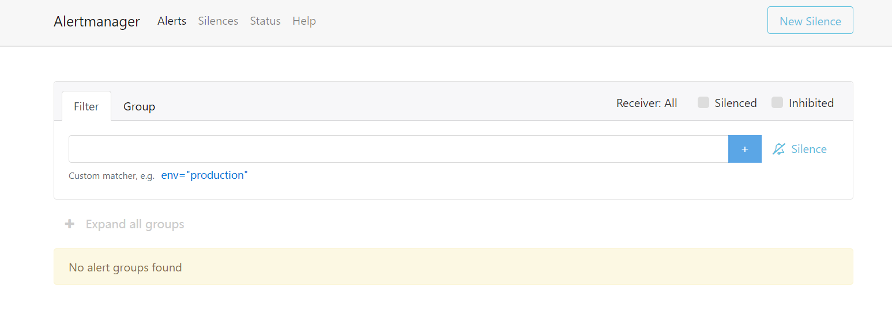
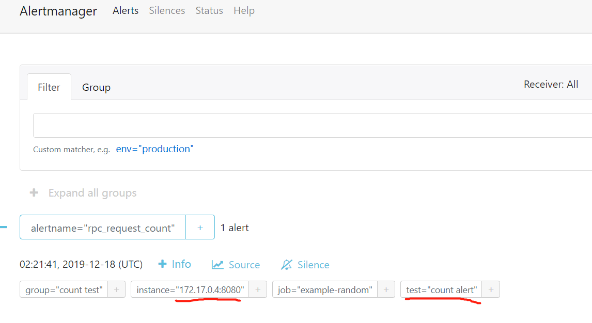
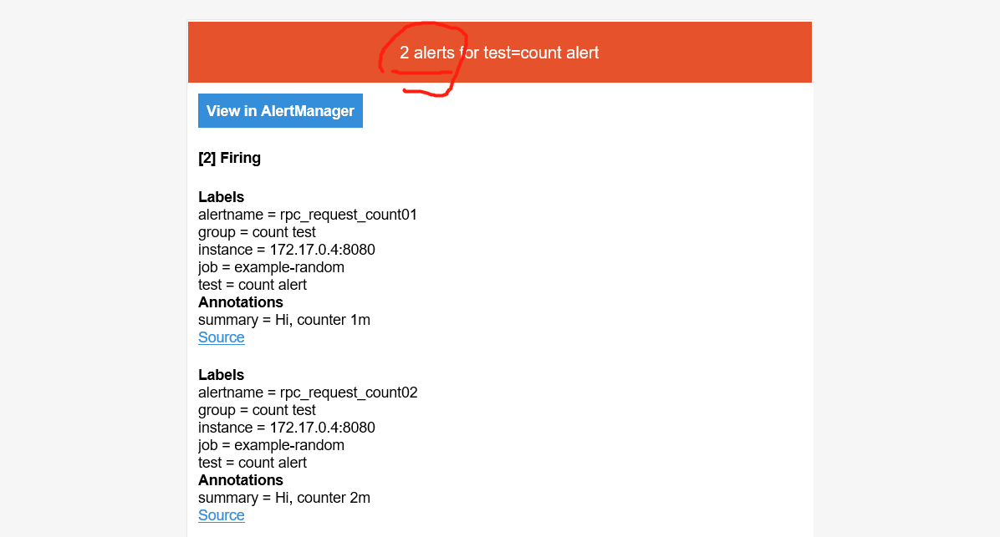

# Alert Manager

- 环境配置
  - 安装：

    ```docker
        docker pull quay.io/prometheus/alertmanager
        docker run -d -p 9093:9093 --name alert -v /tmp:/etc/alertmanager prom/alertmanager
    ```

  - 本地浏览器输入localhost:9093验证是否安装成功
    

  - 本地tmp文件夹中提供[alertmanager.yml](./alertmanager.yml)文件

  - prometheus对接alertmanager
    - 在[prometheus.yml](../prometheus/prometheus.yml)文件中配置Alertmanager configuration
    - targets中的IP为AlertManager运行的网络节点,9093为alertmanager默认端口

    ```yml
      alerting:
        alertmanagers:
        - static_configs:
            - targets:
            - 172.17.0.2:9093
    ```

- Concepts of the AlertManager
  - [doc of AlertManager](https://prometheus.io/docs/alerting/alertmanager/) , [github](https://github.com/prometheus/alertmanager/blob/master/README.md)
  - Grouping categorizes alerts of similar nature into a single notification
  - Inhibition is a concept of suppressing notifications for certain alerts if certain other alerts are already firing.
  - Silences are a straightforward way to simply mute alerts for a given time.
  - Client behavior, The Alertmanager has special requirements for behavior of its client.
  - High Availability, Alertmanager supports configuration to create a cluster for high availability.
- configure of AlertManager
  - command-line, immutable system parameters
  - configuration file
    - inhibition rules
    - notification routing
    - notification receivers
    - email config
  - [configure doc](https://prometheus.io/docs/alerting/configuration/)

## alert

- overview
  - alerting rule
    - 告警规则在[prometheus.rules.yml](../prometheus/prometheus.rules.yml)中定义
    - 告警由prometheus生成，并推送给AlertManager
  - alerts to AlertManager
    - AlertManager接收prometheus推送过来的告警，进行相关的展示、去重、降噪、分组等
    
- create alert rule
  - prometheus configure file, point the rule file, and implements rule of alert in the rule file

    ``` yml
    groups:
    - name: alerttest
        rules:
        - alert: rpc_request_count
            expr: rate(rpc_request_count[1m]) > 0.1
            labels:
                test: count alert
            annotations:
            summary: Hi, counter
    ```

- group of alert
  - 告警可以通过label来分组，对应分组的配置项
    - group_by 按照标签组过滤，形成分组
    - group_wait 收到某种分组类型的告警，等待group_wait时长，后发送通知；等待时间内，有新的同组告警将会用同一个通知发送
    - group_interval 一组通知发送过后，下次发送该组通知的最小时间间隔

## Notification

针对警告发送通知，通知可以通过邮件、短信、具备API接口的社交办公产品接收

- 邮件接收的告警样例
  
- route, 通知路由
  - config in alert manager

  ```yml
    # The root route with all parameters, which are inherited by the child
    # routes if they are not overwritten.
    route:
    receiver: 'default-receiver'
    group_wait: 30s
    group_interval: 5m
    repeat_interval: 4h
    group_by: [cluster, alertname]
    # All alerts that do not match the following child routes
    # will remain at the root node and be dispatched to 'default-receiver'.
    routes:
    # All alerts with service=mysql or service=cassandra
    # are dispatched to the database pager.
    - receiver: 'database-pager'
        group_wait: 10s
        match_re:
        service: mysql|cassandra
    # All alerts with the team=frontend label match this sub-route.
    # They are grouped by product and environment rather than cluster
    # and alertname.
    - receiver: 'frontend-pager'
        group_by: [product, environment]
        match:
        team: frontend
  ```

  - 路由的路径为深度遍历，从左及右
  - 通过分组group_by 和 match标签来匹配接收者

- inhibition 去重操作
  - config in alert manager

  ```yml
    # Matchers that have to be fulfilled in the alerts to be muted.
    target_match:
    [ <labelname>: <labelvalue>, ... ]
    target_match_re:
    [ <labelname>: <regex>, ... ]

    # Matchers for which one or more alerts have to exist for the
    # inhibition to take effect.
    source_match:
    [ <labelname>: <labelvalue>, ... ]
    source_match_re:
    [ <labelname>: <regex>, ... ]

    # Labels that must have an equal value in the source and target
    # alert for the inhibition to take effect.
    [ equal: '[' <labelname>, ... ']' ]
  ```

  - target_match: 需要被去重的告警
  - source_match: 已经存在的告警
  - equal: target 和 source 必须同时具备的标签

- email config
  - config in [alertmanager.yml](./alertmanager.yml)

  ```yml
  smtp_smarthost: 'smtp.qq.com:465'
  smtp_from: 'xxx@qq.com'
  smtp_auth_username: 'xxx@qq.com'
  smtp_auth_password: 'client_auth_password'
  smtp_auth_secret: 'client_auth_password'
  smtp_require_tls: false
  ```

  - 配置邮件协议，此处为smtp_smarthost
  - 配置认证信息，smtp_auth_username、smtp_auth_password

- receiver config
  - config in [alertmanager.yml](./alertmanager.yml)
  - 配置如下

    ```yml
    receivers:
        - name: 'team-X-mails'
        email_configs:
         - to: 'xx.com'
    ```
