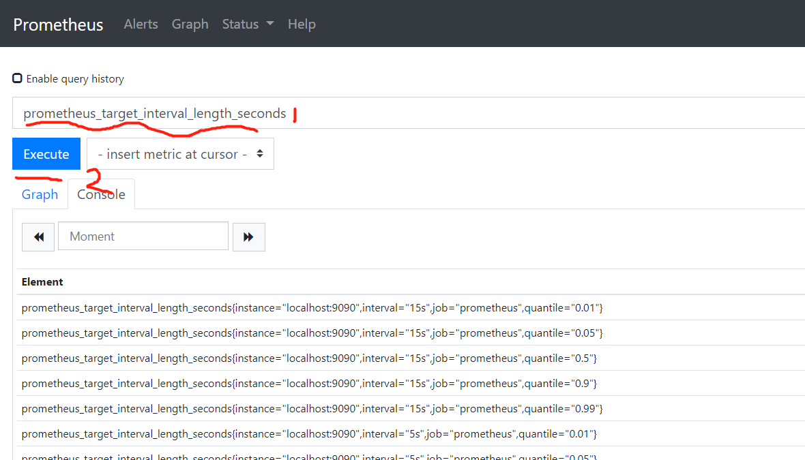

# prometheus

Prometheus is an open-source systems monitoring and alerting toolkit originally built at SoundCloud.

- 监控和报警系统

- [官方文档](https://prometheus.io/docs/introduction/overview/)

- [优秀的中文学习文档](https://yunlzheng.gitbook.io/prometheus-book/)

- [第三方项目文档](https://songjiayang.gitbooks.io/prometheus/content/)

- [docker命令大全](https://docs.docker.com/engine/reference/commandline/docker/)

## 安装

- docker安装

  ``` docker
  docker pull quay.io/prometheus/prometheus
  docker run -d -p 9090:9090 -v /tmp:/etc/prometheus --name prom prom/prometheus
  ```

  - 本地tmp文件夹下提供 [prometheus.yml](./prometheus.yml) 文件

  - targets中的IP为被抓取对象所在的网络节点

- 通过localhost:9090/graph来验证容器是否正常运行
  - 验证示例：在QL查询框中执行一下命令
    - [prometheus_target_interval_length_seconds](https://prometheus.io/docs/prometheus/latest/getting_started/#using-the-expression-browser)
    - [rate(prometheus_tsdb_head_chunks_created_total[1m])](https://prometheus.io/docs/prometheus/latest/getting_started/#using-the-graphing-interface)
    - 

## 基础架构

  

- 基本功能描述
  - the main Prometheus server which scrapes and stores time series data
  - client libraries for instrumenting application code
a push gateway for supporting short-lived jobs
  - special-purpose exporters for services like HAProxy, StatsD, Graphite, etc.
  - an alertmanager to handle alerts
  - various support tools

## 基础概念

- Data Model
  - Metric names
    - The metric name specifies the general feature of a system that is measured
    - must match the regex [a-zA-Z_:][a-zA-Z0-9_:]*
      > The colons are reserved for user defined recording rules. They should not be used by exporters or direct instrumentation.

  - Metric labels
    - Labels enable Prometheus's dimensional data model: any given combination of labels for the same metric name identifies a particular dimensional instantiation of that metric(类似于filter)
    - must match the regex [a-zA-Z_][a-zA-Z0-9_]*. Label names beginning with __ are reserved for internal use.

  - [best practices for naming metrics and labels](https://prometheus.io/docs/practices/naming/)

  - Samples, which form the actual time series data
    - a float64 value, 客户端采集的数据
    - a millisecond-precision timestamp, 数据采集的时的时间戳

  - Notation
    - Given a metric name and a set of labels, time series are frequently identified using this notation:

      ```xml
      <metric name>{<label name>=<label value>, ...}
      ```

- Metric types
  - Counter
    - A counter is a cumulative metric that represents a single monotonically increasing counter whose value can only increase or be reset to zero on restart;（全局自增长计数器）
    - Do not use a counter to expose a value that can decrease
  - Gauge
    - A gauge is a metric that represents a single numerical value that can arbitrarily go up and down.
  - Histogram
    - A histogram samples observations (usually things like request durations or response sizes) and counts them in configurable buckets. It also provides a sum of all observed values.
    - 用于统计数据的分布状态分析，如长尾问题的解决等；[histogram中文](https://ryanyang.gitbook.io/prometheus/di-er-zhang-gai-nian/metric_types#histogram-zhi-fang-tu)
    - basename_bucket{le=(up inclusive bound）}，表示落在某一区间的数量统计
    - basename_sum{}, 表示统计区间的统计量的值的总和
    - basename_count{le=(up inclusive bound）},表示统计某一统计区间的统计次数（count of events）
  - Summary
    - Similar to a histogram, a summary samples observations (usually things like request durations and response sizes). it calculates configurable quantiles over a sliding time window.
    - 直接存储分位数，通过分位数φ来找寻落点basename{quantile="<φ>"}

- Jobs and Instances
  - instance, an endpoint you can scrape is called an instance
  - Job, A collection of instances with the same purpose
  - 对目标进行监控时，会自动生成与目标相关的Job和Instance
    - job: The configured job name that the target belongs to.
    - instance: The host:port part of the target's URL that was scraped.
    - 针对每个instance, Prometheus会提供默认的数据监控
      - up{job="<job-name>", instance="<instance-id>"}: 1 if the instance is healthy, i.e. reachable, or 0 if the scrape failed.
      - scrape_duration_seconds{job="<job-name>", instance="<instance-id>"}: duration of the scrape.
      - scrape_samples_post_metric_relabeling{job="<job-name>", instance="<instance-id>"}: the number of samples remaining after metric relabeling was applied.
      - scrape_samples_scraped{job="<job-name>", instance="<instance-id>"}: the number of samples the target exposed.
      - scrape_series_added{job="<job-name>", instance="<instance-id>"}: the approximate number of new series in this scrape. New in v2.10

- config
  - [配置列表](https://prometheus.io/docs/prometheus/latest/configuration/configuration/#configuration)
  - scrape_configs： 监测目标配置
    - job_name
      - scrape_interval
      - scrape_interval
      - metrics_path： 默认/metrics
      - scheme: 默认http
      - tls_config
      - azure_sd_configs

  - tls_config
    - ca_file
    - cert_file
    - key_file
    - server_name
    - insecure_skip_verify

  - azure_sd_config
    - __meta_azure_machine_id
    - __meta_azure_machine_id
    - __meta_azure_machine_scale_set

  - consul_sd_config
    - __meta_consul_address

  - file_sd_config
    - 文件配置形式，可以通过在指定文件中描述配置信息周期性的更新Prometheus的scrap配置

  - kubernetes_sd_config [example](https://github.com/prometheus/prometheus/blob/release-2.14/documentation/examples/prometheus-kubernetes.yml)
    - node: discovers one target per cluster node with the address defaulting to the Kubelet's HTTP port
    - service: discovers a target for each service port for each service.
    - pod: discovers all pods and exposes their containers as targets
    - endpoints: discovers targets from listed endpoints of a service.
    - ingress: discovers a target for each path of each ingress.

  - Configuring rules
    - rule_files： 监测规则配置文件，可以在运行时reload;promtool支持语法检查
    - Recording rules
      - 数据采集规则，可以定义metric name、labels、PromQL的expr表达式
    - Alerting rules
      - 报警规则，
      - 满足条件时，生成报警，pending, fire， 被 AlertManager进一步处理后展示

  - relabel_config
    - 对原有标签做新的事件处理
    - source_labels
    - replacement
    - target_label
    - regex
    - action
    - 解释：对source_labels中的标签，通过regex匹配，对匹配上的标签执行action动作; 如果为replace的action,通过target_label替换replacement

  - alertmanager_config
    - Alert manager是另外一个应用，需要配置相应的目标地址

        ``` yml
        # Alertmanager configuration
        alerting:
        alertmanagers:
        - static_configs:
            - targets:
            - 172.17.0.4:9093
        ```

- query
  - PromQL 用于查询监控数据的查询语言
  - data types
    - Instant vertor 时间序列集合，每个时间序列中只有一个样本，时间序列共享一个时间戳
      > time serie时间序列的具体含义是什么，随着时间的推移，产生的监控数据，以时间为序列，组织成一个数据集合
    - Range vector 时间序列集合，每个时间序列中含有一段时间内的数据
    - Scalar 一个浮点型数据
  - Time series Selectors
    - Instant Vector Selector
      - 通过Data Model 中的notation表达式来过滤数据，其中针对label的过滤有正则表达式的匹配方式
        - =~ 匹配正则
        - !~ 不匹配正则
    - Range Vector Selectors
      - 中括号(brackets)内指定过去的时间段内
      - 指定时间内，按照配置频率收集的监测数据集合
    - offset 相对于查询时间之前的时间，用于定位时间基点
      - in the past to the current
      - 例子 http_requests_total offset 5m 相当去当前，过去的5分钟时刻点，监测的瞬时数据
        > http_requests_total[5m] offset 1w) 一周前时刻为基准点，过去的5分钟内监测的数据
  - operators 算术二元操作最终落脚到value（float数值上），通过其他运算符删选算术运算符的操作数
    - Binary operators
      - 不能有range vector参与
    - Vector matching
      - 一对一、一对多、多对一
    - Aggregation operators
      - [内置运算符](https://prometheus.io/docs/prometheus/latest/querying/operators/#aggregation-operators)
  - HTTP API 提供给外部第三方系统的PromQL能力
    - Instant queries (query)

    ```C
      curl 'http://localhost:9090/api/v1/query?query=up&time=2015-07-01T20:10:51.781Z'
    ```

    - Range queries (query_range)

    ```C
      curl 'http://localhost:9090/api/v1/query_range?query=up&start=2015-07-01T20:10:30.781Z&end=2015-07-01T20:11:00.781Z&step=15s'
    ```

    - Querying metadata raw data
      - Finding series by label matchers

- storage
  - 本地
    - 磁盘文件；两小时为一个文件单位
      - 元数据
      - chunk数据
      - 索引数据
      - 为压缩的WAL文件数据
      - 删除操作的日志tombstone
  - 远程
    - 读数据路径
    - 写数据路径

- faderation
  - metrics_path: '/federate' 该路径为faderation集群节点暴露的数据端口
  - Hierarchical federation
  - Cross-service federation

- 高可用性
  - 主备HA， 可用性
  - 远程存储， 持久化
  - 联邦集群， 可扩展
