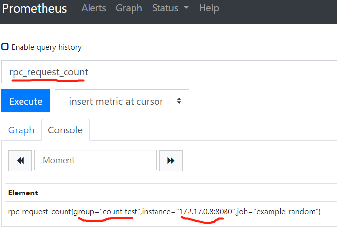

# Client SDK

## 运行

- 编译软件

```go
  go get -d
  go build
```

- 运行

```shell
 nohup ./random -listen-address=:8080 &
```

### 数据展示

- 以rpcCounts变量为例
  - 为Counter类型数据
  - 没10s增加一次计数

- prometheus增加配置项

```yml
- targets: ['172.17.0.8:8080']
        labels:
          group: 'count test'
```

- 示例结果
  
